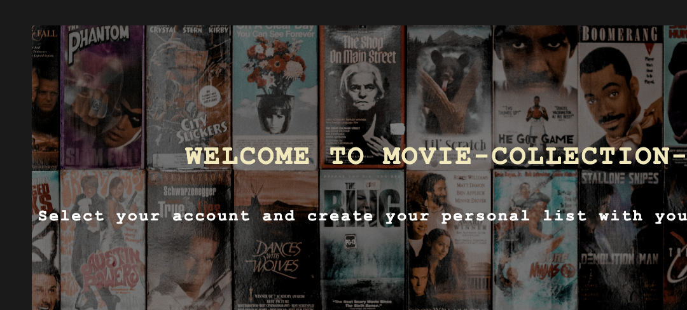

# MoviWebApp

A Flask-based web application that allows users to create accounts and manage their personal movie collections. Users can add, view, update, and delete movies from their collections, with movie data fetched from the OMDb API.

## 🚀 Live Demo

Check out the live version of the app: [MoviWebApp Live Demo](https://ananasweb.pythonanywhere.com/)

## 📸 Screenshot



## Features

- User account management
- Search and add movies using OMDb API
- View personal movie collection
- Update movie information
- Delete movies from collection
- Responsive design

## Prerequisites

- Python 3.8+
- pip (Python package manager)
- OMDb API key (get one at [OMDb API](http://www.omdbapi.com/apikey.aspx))

## Installation

1. Clone the repository:
   ```bash
   git clone https://github.com/anastasiafoth/MoviWebApp.git
   cd MoviWebApp
   ```

2. Create and activate a virtual environment:
   ```bash
   python -m venv venv
   source venv/bin/activate  # On Windows use `venv\Scripts\activate`
   ```

3. Install the required packages:
   ```bash
   pip install -r requirements.txt
   ```

4. Create a `.env` file in the project root and add your OMDb API key:
   ```
   API_KEY=your_omdb_api_key_here
   ```

## Database Setup

The application uses SQLite database which will be automatically created when you first run the application.

## Running the Application

1. Initialize the database:
   ```bash
   python -c "from app import app, db; app.app_context().push(); db.create_all()"
   ```

2. Start the Flask development server:
   ```bash
   python app.py
   ```

3. Open your web browser and navigate to `http://127.0.0.1:5000`

## Project Structure

```
MoviWebApp/
├── data/                  # Database files
├── static/                # Static files (CSS, images)
│   ├── style.css          # Main stylesheet
│   ├── background.jpg     # Background image
│   └── placeholder.jpg    # Default movie poster
├── templates/             # HTML templates
│   ├── base.html          # Base template
│   ├── index.html         # Home page
│   ├── movies.html        # User's movie collection
│   ├── 404.html           # 404 error page
│   └── 500.html           # 500 error page
├── app.py                # Main application file
├── data_manager.py       # Data handling logic
├── models.py             # Database models
└── requirements.txt      # Python dependencies
```

## Dependencies

- Flask 3.0.0
- Flask-SQLAlchemy 3.1.1
- SQLAlchemy 2.0.23
- requests 2.31.0
- python-dotenv 1.0.0
- Werkzeug 3.0.1
- Jinja2 3.1.2
- itsdangerous 2.1.2
- click 8.1.7
- MarkupSafe 2.1.3

## Contributing

1. Fork the repository
2. Create a new branch (`git checkout -b feature/AmazingFeature`)
3. Commit your changes (`git commit -m 'Add some AmazingFeature'`)
4. Push to the branch (`git push origin feature/AmazingFeature`)
5. Open a Pull Request

## License

This project is licensed under the MIT License - see the [LICENSE](LICENSE) file for details.
